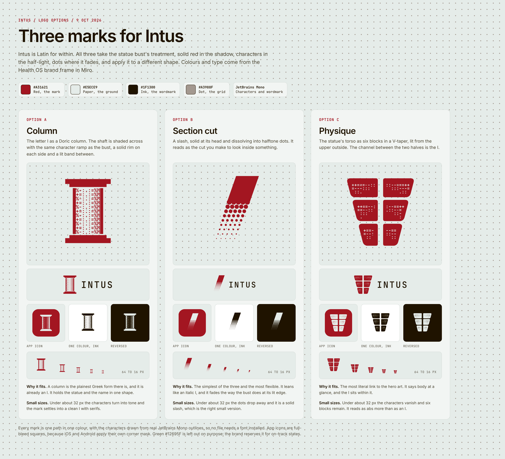

# Intus logo options

Three marks, all built from the Health OS brand frame in Miro ("04 Visual language"): red `#A31621`, paper `#E5ECE9`, ink `#1F1300`, dot `#A3988F`, with JetBrains Mono for the characters and the wordmark. They take the statue bust's treatment (solid red in the shadow, characters in the half-light, dots where it fades) and apply it to three different shapes.



| Option | Mark | Idea | At small sizes |
| --- | --- | --- | --- |
| A, Column | `intus-a-column*.svg` | The letter I as a Doric column, shaded across with the bust's character ramp. | Under about 32 px the characters turn into tone and it settles into an I with serifs. |
| B, Section cut | `intus-b-slash*.svg` | A slash, solid at its head and dissolving into halftone dots, like the cut you make to look inside. | Under about 32 px the dots drop away and it is a solid slash. |
| C, Physique | `intus-c-physique*.svg` | The statue's torso as six blocks in a V-taper. The channel between the halves is the I. | Under about 32 px the characters vanish and six blocks remain. It reads as abs more than as an I. |

## Files

Each option has six files, named `intus-<letter>-<name>` plus a suffix:

- no suffix: the mark in red, on a transparent ground
- `-ink`, `-paper`: the same mark in one colour, for light and dark grounds
- `-lockup`: the mark with the INTUS wordmark in ink, tracked 0.12em as in the app
- `-lockup-reversed`: the lockup in paper, for red or ink grounds
- `-icon`: paper mark on a full-bleed red square. iOS and Android apply their own corner mask, so the square has no rounded corners.

Every mark is one path in one colour, with the characters drawn from real JetBrains Mono outlines, so no file needs a font installed.

## Notes

- Miro's design system keeps red for the one main action on a screen. Where that matters, such as the app header next to a red button, use the `-ink` mark.
- Green `#12695F` is left out on purpose. The brand reserves it for on-track states.
- Nothing here has had an app store, trademark or visual similarity check. `docs/product/naming.md` lists the filters to run before one is chosen, and the options should be compared against Bevel, Whoop and Oura marks too.
- The shapes are not wired into the app yet. `src/components/brand.tsx` still draws the red square and the mono wordmark.

## Regenerating

```
npm i --no-save @fontsource/jetbrains-mono
pip install fonttools
python3 scripts/brand_logos.py --fonts node_modules/@fontsource/jetbrains-mono/files --out docs/brand/logos
```

The geometry for each option is a short function in `scripts/brand_logos.py`.
